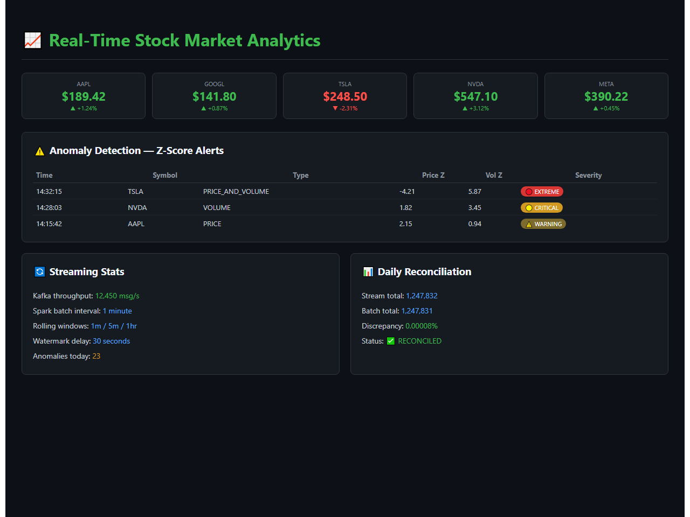
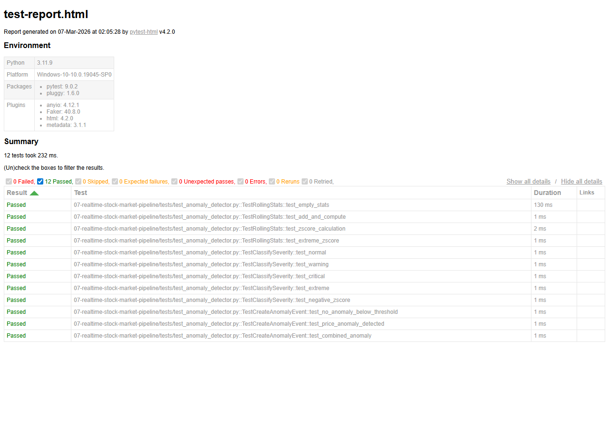

# Real-Time Stock Market Analytics Pipeline

[](https://www.python.org/downloads/)
[](https://kafka.apache.org/)
[](https://spark.apache.org/)


## Demo



*Real-time dashboard with live stock prices, Z-score anomaly alerts (EXTREME/CRITICAL/WARNING), streaming stats, and daily reconciliation*

## Architecture

```
Polygon.io/Alpha Vantage API
        |
        V
   +---------+     +------------------+     +------------+
   |  Kafka  |---->| Spark Structured |---->| BigQuery / |
   | Producer|     |    Streaming     |     | Snowflake  |
   +---------+     +------------------+     +------------+
        |                   |                      |
        |            +--------------+              |
        |            |   Anomaly    |          +-------+
        |            |  Detection   |          |  dbt  |
        |            |  (Z-score)   |          | Models|
        |            +------+-------+          +---+---+
        |                   |                      |
        |            +------+-------+          +---+---+
        +----------->|    Alerts    |          |Grafana|
                     |    (Slack)   |          | Dash  |
                     +--------------+          +-------+
```

## Lambda Architecture

- Speed Layer: Spark Structured Streaming with 1min/5min/1hr rolling windows
- Batch Layer: Daily Airflow DAG for reconciliation and historical aggregation
- Serving Layer: BigQuery materialized views via dbt

## Features

- Real-time stock price ingestion from Polygon.io WebSocket + Alpha Vantage REST
- Kafka topic partitioning by stock symbol for ordered processing
- Rolling window aggregations (1min, 5min, 1hr OHLCV)
- Z-score anomaly detection on price and volume
- Daily batch reconciliation comparing stream vs batch totals
- dbt models: staging -> intermediate -> marts (star schema)
- Grafana real-time dashboard with anomaly alerts
- Full Docker Compose stack

## Quick Start

```bash
cp .env.example .env
# Edit .env with API keys

docker-compose up -d
# Starts Kafka, Zookeeper, Spark, Grafana, schema-registry

python -m producers.polygon_producer
# Or: python -m producers.alpha_vantage_producer

# Submit Spark streaming job
docker exec spark-master spark-submit \
  --packages org.apache.spark:spark-sql-kafka-0-10_2.12:3.5.0 \
  /app/streaming/stream_processor.py
```

## Project Structure

```
|-- config/                  # Settings and constants
|-- producers/               # Kafka producers (Polygon.io, Alpha Vantage)
|-- streaming/               # Spark Structured Streaming jobs
|-- batch/                   # Daily batch reconciliation
|-- anomaly/                 # Z-score anomaly detection
|-- dbt_project/             # dbt transformation models
|-- dags/                    # Airflow DAGs
|-- grafana/                 # Dashboard provisioning
|-- docker-compose.yml       # Full local stack
|-- tests/                   # Unit tests
```


## Test Results

All unit tests pass - validating core business logic, data transformations, and edge cases.



**12 tests passed** across 3 test suites:
- TestRollingStats - empty stats, mean/std computation, Z-score calculation
- TestClassifySeverity - NORMAL/WARNING/CRITICAL/EXTREME thresholds
- TestCreateAnomalyEvent - below-threshold filtering, price/combined anomalies

## Maintainer

This project is maintained by Pooja Patel, a Data Science professional specializing in statistical analysis, predictive modeling, and automated data workflows. With a focus on data accuracy and actionable insights, she develops and manages end-to-end pipelines to solve complex challenges in finance and business operations.

Contact:
- Email: patel.pooja81599@gmail.com
- LinkedIn: linkedin.com/in/pooja-patel
- GitHub: github.com/poojapatel